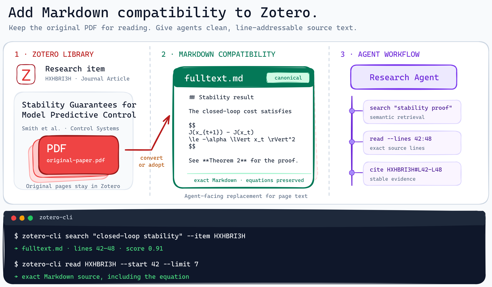

<div align="center">

# Zotero-Agent-Library

### Zotero is PDF-first. However, AI Agents need a Markdown interface for filesystem-like search, high-precision reading, and grounded citations.

[Install](#install) · [See it work](#see-it-work) · [Markdown integration](#how-it-works) · [CLI reference](#cli-reference) · [Uninstall](#uninstall)

</div>

<p align="center">
  
</p>

<p align="center"><a href="./assets/readme/zotero-markdown-compatibility.excalidraw">Editable Excalidraw source</a></p>

---

> [!IMPORTANT]
> This project reads the active local Zotero library and requires Zotero Desktop to be running. For safety, SQLite access is immutable and read-only. Paper text stays on the machine; Chroma downloads its ONNX MiniLM model once, but the project sends no paper full text to cloud embedding or LLM services and has no telemetry. The only Zotero writes in v0.3.0 are confirmed Markdown Full Text adoptions through an authenticated loopback Zotero Extension. [Uninstall](#uninstall) removes the CLI, Extension, Skill, and project state without deleting Zotero items or attachments.

## Introduction

### The problem with Zotero for AI agents

Zotero libraries are organized around PDF attachments and bibliographic records. Humans read PDFs; however, LLM-based AI agents need Markdown in plain text to read papers precisely. No project handles this complete problem in one place.

- [`cli-anything-zotero`](https://github.com/PiaoyangGuohai1/cli-anything-zotero) provides broad Zotero automation, but no Markdown integration.
- [`zotero-mcp`](https://github.com/54yyyu/zotero-mcp) provides local semantic retrieval using parsed PDFs rather than precise Markdown.
- [`zotero-markdb-connect`](https://github.com/daeh/zotero-markdb-connect) provides Markdown-note compatibility rather than compatibility with the Markdown papers themselves.


### What is this project?

This project achieves Markdown compatibility within Zotero: a converted paper can have one Zotero-owned `fulltext.md` child attachment. The CLI prefers it for semantic Passage indexing and exact reading, falls back to the PDF when it is absent, and keeps every result tied to the Literature Item Key and source location.

This repository adapts relevant behavior from [`cli-anything-zotero`](https://github.com/PiaoyangGuohai1/cli-anything-zotero) and [`zotero-mcp`](https://github.com/54yyyu/zotero-mcp) for the canonical Markdown attachment contract, local ONNX search, independent agent sessions, and a fixed authenticated Full Text write boundary.

This project is a pack of `cli` + `skill` + `zotero-extension` for AI Agent.

## Install

Version 0.3.0 is Linux-only and supports Zotero 7–9. It requires Python 3.10+, [`uv`](https://docs.astral.sh/uv/), Poppler, `make`, `zip`, and `unzip`.

### Option 1: Install from the command line

Run these commands from a local checkout of this repository:

```bash
cd /path/to/zotero-paper-file-system
sudo apt install poppler-utils make zip unzip
uv tool install --force ./zotero-cli
make -C zotero-extension
```

In Zotero, open **Tools → Add-ons → Install Add-on From File**, select
`zotero-extension/build/zotero-agent-library-0.3.0.xpi`, and restart Zotero.
Then install the Agent Skill:

```bash
skill_dir="$HOME/.agents/skills/research-with-zotero"
rm -rf "$skill_dir"
mkdir -p "$skill_dir"
cp -a skills/research-with-zotero/{SKILL.md,LICENSE,references} "$skill_dir/"

zotero-cli --version
zotero-cli --json app doctor
```

### Option 2: Ask your Agent to install it

```text
Install this repository for me.
```

`doctor` checks Zotero, its Local API, the matching Extension and protocol, token permissions, Poppler, the database schema, and semantic-index readability.

| What it touches | Purpose |
| --- | --- |
| `~/.local/share/uv/tools/zotero-cli/` and `~/.local/bin/zotero-cli` | CLI environment and executable |
| Active Zotero profile `extensions/` | Extension XPI, managed by Zotero |
| `~/.agents/skills/research-with-zotero/` | Runtime Agent instructions |
| `~/.config/zotero-agent-library/` | Mode-`0600` bridge token, sessions, and write audit |
| `~/.local/share/zotero-agent-library/index/<profile>/` | Profile-specific Chroma Passage index |
| Zotero attachment storage | Canonical `fulltext.md` only after an explicit confirmed adoption |

<details>
<summary><b>Development XPI upgrades</b></summary>

A development build can be installed without UI automation by closing Zotero and atomically replacing `<profile>/extensions/zotero-agent-library@local.xpi`. Follow the guarded procedure in [`zotero-extension/README.md`](zotero-extension/README.md#development-install-or-upgrade); do not edit Zotero's generated `extensions.json`.

</details>

---


## See it work

The following abbreviated transcript comes from the v0.3.0 local acceptance index. It was a scoped run, not a claim of whole-library coverage.

```console
$ zotero-cli --json index status
{"ok":true,"code":"OK","data":{"count":21490,"item_count":147,"embedding_model":"all-MiniLM-L6-v2","source_counts":{"markdown":136,"pdf":21354},"initialized":true}}

$ zotero-cli --json search \
    "reinforcement learning model predictive control" \
    --item HXHBRI3H --limit 3
{"ok":true,"code":"OK","data":{"total_found":3,"results":[{"item_key":"HXHBRI3H","similarity_score":0.3684,"provenance":{"source_kind":"markdown","location":"lines 11-19"}}]}}

$ zotero-cli read HXHBRI3H --start 11 --limit 9 > passage.txt
[HXHBRI3H, C8TUAW4W, lines 11-19]
```

The search hit is a lead. The final command opens the source range that supports or rejects the claim; the Agent Skill cites verified Markdown as `[ITEM_KEY, fulltext.md, lines N–M]` and PDF evidence as `[ITEM_KEY, PDF, page N]`.

## Getting started

1. Confirm the local stack:

   ```bash
   zotero-cli --json app doctor
   ```

2. Build or refresh the index explicitly. Search never updates it on its own:

   ```bash
   zotero-cli --json index update
   # Or limit the work:
   zotero-cli --json index update --collection "/My Library/Project"
   zotero-cli --json index update --item ITEM_KEY
   ```

3. Discover papers, then inspect and verify a candidate:

   ```bash
   zotero-cli --json search "stability proof" --limit 10
   zotero-cli --json lookup ITEM_KEY
   zotero-cli --json source ITEM_KEY
   zotero-cli --json read ITEM_KEY --start 1 --limit 200
   zotero-cli --json find ITEM_KEY "exact phrase" --context 8
   ```

4. Create one Browsing Session when Collection navigation matters:

   ```bash
   session="${ZOTERO_CLI_SESSION:-${PI_SESSION_ID:-research-1}}"
   zotero-cli --json session create "$session"       # once
   zotero-cli --session "$session" --json ls
   zotero-cli --session "$session" --json cd "Project"
   zotero-cli --session "$session" --json pwd
   ```

Use `zotero-cli --help` and nested command help as the installed syntax reference. Human-readable output is the default; agents and scripts should pass `--json`.

## How it works

A Literature Item keeps its stable Zotero Item Key, metadata, Collection memberships, PDF Source Document, and optional Markdown Full Text together. The CLI selects canonical Markdown first for reading and indexing. Without it, Poppler extracts the selected PDF while preserving page boundaries. Conversion itself stays outside this project; after explicit review, the Extension can import an existing Markdown child attachment as stored `fulltext.md` without rewriting its bytes.

<details>
<summary><b>Components and data flow</b></summary>

| Component | Responsibility |
| --- | --- |
| `zotero-cli/` | Immutable catalog reads, sessions, source selection, bounded reading, local indexing/search, migration plans, and confirmed adoption requests |
| `zotero-extension/` | Bearer-authenticated loopback `health` and `fulltext_adopt` operations implemented with Zotero APIs |
| `skills/research-with-zotero/` | Agent workflow: session choice, retrieval routing, source verification, citation format, and mutation boundaries |

Retrieval follows four steps:

1. `index update` selects `fulltext.md` or the PDF fallback and stores overlapping 1,500-character Passages with 200-character overlap.
2. Chroma's local `all-MiniLM-L6-v2` model embeds Passage text and structured item metadata. There is no per-item Passage cap.
3. Global search over-fetches Passage candidates, keeps the best Passage per Literature Item, and returns source hashes, attachment keys, chunk offsets, and line/page locations.
4. `read` or `find` reopens the preferred source for exact verification. Notes and Annotations never enter the source index.

Version 0.3.0 has one write route. `fulltext adopt` snapshots the reviewed attachment path and SHA-256, then the Extension revalidates live Zotero state, imports a stored copy, validates `fulltext.md`, adds `zotero-cli:fulltext`, marks the unique PDF Source Document, and moves selected predecessor attachments to Zotero Trash. A successful write immediately attempts to rebuild that item's Passages.

</details>

<details>
<summary><b>Source-selection contract</b></summary>

Canonical Markdown Full Text must be all of the following:

- a child attachment of the Literature Item;
- a Zotero-owned stored file, never a link or symlink;
- named exactly `fulltext.md`;
- titled `Markdown Full Text`;
- tagged `zotero-cli:fulltext`;
- non-PDF content.

If canonical Markdown is absent, one PDF is selected automatically. Multiple PDFs require exactly one `zotero-cli:source` tag. PDF changes do not invalidate canonical Markdown, and `distill.md`, `probe_distill.md`, Zotero Notes, and Annotations are never promoted by inference.

</details>

## CLI reference

| Command | Current v0.3.0 behavior |
| --- | --- |
| `app doctor` | Validate the local application, bridge, tools, schema, versions, and index |
| `session create/status` | Manage independent per-agent navigation state |
| `pwd`, `cd`, `ls` | Navigate Collection paths without using Zotero UI selection |
| `lookup`, `source` | Inspect Literature Item metadata and preferred attachment |
| `read`, `find` | Read bounded source lines or locate exact text; `read --all` emits complete raw text |
| `index update/status/inspect` | Explicitly maintain and diagnose the profile-specific Passage index |
| `search` | Search indexed Passages globally or within an explicit Collection/item scope |
| `fulltext audit` | Produce a read-only migration plan for existing Markdown attachments |
| `fulltext adopt` | Import a reviewed existing Markdown child attachment as canonical Full Text |
| `fulltext migrate` | Apply only reviewed `candidate` entries from a migration plan |

<details>
<summary><b>Runtime files and concurrency</b></summary>

Browsing Sessions are separate mode-`0600` JSON files written atomically under `~/.config/zotero-agent-library/sessions/`. Each session stores a stable Collection Key, so two agents can navigate different Collections without sharing a hidden working directory.

Semantic updates use a cross-process lock and bounded Chroma batches. Reads and searches can run concurrently. Extension writes pass through one bounded queue, and `~/.config/zotero-agent-library/audit.jsonl` records only write time, Session ID, operation, affected keys, result, and error code. It excludes tokens, full text, note bodies, search queries, and read activity.

</details>

<details>
<summary><b>Current boundaries</b></summary>

Version 0.3.0 does not provide general ingest, metadata editing, Collection mutation, duplicate merging, OCR, DOCX citation automation, or permanent deletion. It does not package converted image assets; figure verification returns to the PDF. The implemented catalog and Full Text bridge operate on My Library; group libraries are outside the current command surface.

The index is fresh and profile-specific. It neither reads nor migrates the old `zotero-mcp` Chroma database. External Zotero changes appear after the next explicit `index update`; failed extraction is reported as partial coverage rather than silently omitted.

</details>

## FAQ

### Does Markdown replace the PDF?

No. The PDF remains the Source Document and the place to verify page layout and figures. Canonical Markdown provides clean local Passage search and exact line addressing.

### Does this project convert PDFs to Markdown?

No. Conversion and OCR are external, converter-agnostic steps run only on explicit user intent. The current bridge adopts an existing Markdown child attachment after path, hash, source-PDF, and conflict checks.

### Does paper content leave the machine?

The semantic index and embedding inference are local. Chroma may download the roughly 80 MB ONNX model on first use, and Zotero may synchronize stored attachments according to the user's own sync settings; this project has no telemetry and sends no paper text to an external embedding or LLM API.

## Contributing

Run the smallest complete local checks before submitting a change:

```bash
(cd zotero-cli && uv sync --locked && uv run python -m unittest discover -s tests -v)
make -C zotero-extension clean check
uvx --from skills-ref agentskills validate skills/research-with-zotero
```

Keep CLI syntax in Click help, multi-command research rules in the Skill, and durable design decisions in `docs/` or an ADR. Direct SQLite writes, arbitrary Zotero JavaScript, cloud processing of paper text, and permanent deletion are outside the project contract.

## Documentation

- [Domain language](CONTEXT.md)
- [CLI shape](docs/cli.md)
- [Semantic indexing](docs/indexing.md)
- [Extension bridge](docs/bridge.md)
- [Markdown migration](docs/migration.md)
- [Architecture decisions](docs/adr/)

## License and provenance

The repository is licensed under Apache-2.0. It is based on [`cli-anything-zotero`](https://github.com/PiaoyangGuohai1/cli-anything-zotero) at commit `f621952f3645546573d622440cbf707320f7a35f`; semantic-search behavior is also derived from [`zotero-mcp`](https://github.com/54yyyu/zotero-mcp) 0.6.2 under MIT. Modified-file provenance and retained licenses are recorded in [`zotero-cli/UPSTREAM.md`](zotero-cli/UPSTREAM.md), [`zotero-extension/UPSTREAM.md`](zotero-extension/UPSTREAM.md), and `zotero-cli/LICENSES/`.


### Uninstall

Remove **Zotero Agent Library Bridge** in Zotero's Add-ons manager and restart Zotero, then run:

```bash
uv tool uninstall zotero-cli
rm -rf ~/.agents/skills/research-with-zotero
rm -rf ~/.config/zotero-agent-library ~/.local/share/zotero-agent-library
```

Removing project state does not remove Literature Items, PDFs, Markdown attachments, or Zotero's database. If this installation replaced a `zotero-cli` supplied by another uv tool, reinstall that tool to restore its executable.
